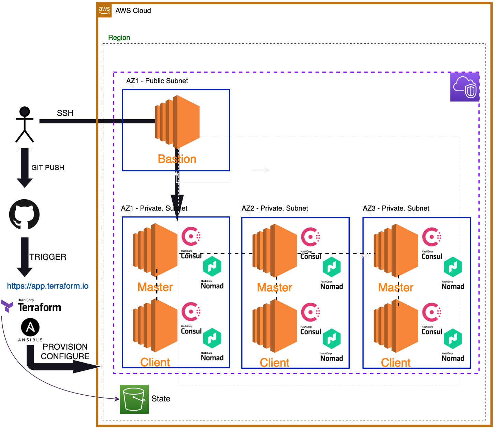

# Deploy Hashistack on AWS using Terraform & Ansible.
This repo contains IaC for setting up Hashistack in AWS cloud.
## Tech Stack
- IaC: Terraform, Ansible
- HashiCorp stack: Consul, Nomad, ~Vault~
- Infra: EC2@AWS, Ubuntu OS
- Docker

## The Big Picture

## Usage
### Prerequisites
* Configure [AWS CLI creds](https://docs.aws.amazon.com/cli/latest/userguide/cli-configure-quickstart.html).

### How to run?
1. Clone the repo
2. Edit the vars.tf for ...
   1. AWS (region?)
   2. Hashistack cluster config

NOTE. If you changed AWS region, please make sure to change the ami_id variable as well. You can check [here](https://cloud-images.ubuntu.com/locator/ec2/) to find respective Ubuntu ami ID for your AWS region.

3. Apply the terraform code.

    terraform init
    terraform validate
    terraform plan -out tf_plan.out
    terraform apply tf_plan.out

Terraform apply will make sure it will provision all required infrastructure and calls Ansible to install/configure Hashistack cluster on top of it.

NOTE. In orer to ssh to the Bastion host, please use "hashi_cluster.pem" key in your project folder. The key is generated during the provisioning and added to the Bastion host too, and the key will be used when running Ansible part.

## Docs
Install instructions are taken from ...
[Vault](https://developer.hashicorp.com/vault/docs/install)
[Consul](https://developer.hashicorp.com/consul/downloads)
[Nomad](https://developer.hashicorp.com/nomad/docs/install)

