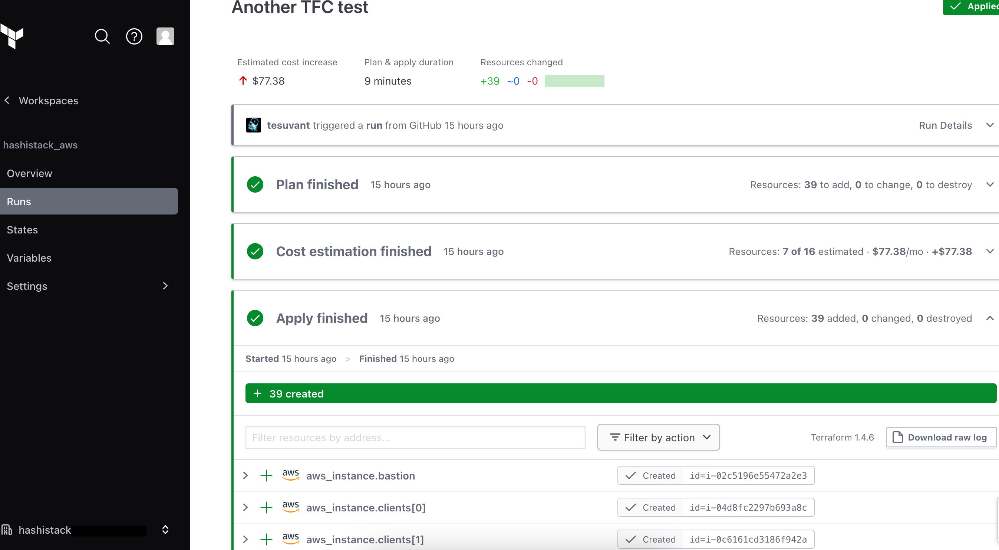

# Deploy Hashistack on AWS using Terraform & Ansible.
This repo contains IaC for setting up Hashistack in AWS cloud.
## Tech Stack
- IaC: Ansible, Terraform, [Terraform Cloud](https://app.terraform.io/)
- Infra: AWS, EC2, S3, Ubuntu OS
- SW: Consul, Docker, Nomad, ~Vault~c
## The Big Picture


## Usage
### Prerequisites
* Configure [AWS CLI creds](https://docs.aws.amazon.com/cli/latest/userguide/cli-configure-quickstart.html).

### Run locally
1. Clone the repo
2. Edit the vars.tf for ...
   1. AWS (region?)
   2. Hashistack cluster config
3. Create S3 bucket and edit backend.tf respectively

NOTE. If you changed AWS region, please make sure to change the ami_id variable as well. You can check [here](https://cloud-images.ubuntu.com/locator/ec2/) to find respective Ubuntu ami ID for your AWS region.

4. Apply the terraform code.

    terraform init
    terraform validate
    terraform plan -out tf_plan.out
    terraform apply tf_plan.out

Terraform apply will make sure it will provision all required infrastructure and calls Ansible to install/configure Hashistack cluster on top of it.

NOTE. In orer to ssh to the Bastion host, please use "hashi_cluster.pem" key in your project folder. The key is generated during the provisioning and added to the Bastion host too, and the key will be used when running Ansible part.
### or use Terraform Cloud
Terraform Cloud is a cloud-based platform provided by HashiCorp that facilitates the management and collaboration of Terraform configurations for infrastructure provisioning.

1. Fork the repo
2. Login to Terraform Cloud (or [create account](https://app.terraform.io/public/signup/account) at first)
3. Create workspace & project
4. [Connect project](https://developer.hashicorp.com/terraform/cloud-docs/vcs/github-app) to your Github repository
5. Trigger a run



## Test Submitting a Job

1. SSH to Bastion host. Copy the private key from terraform output.
```
me@host:~$ ssh -i ./ssh/bastion.pem ubuntu@13.48.177.76
```
2. SSH to a client host.
3. Export NOMAD_ADDR environment variable
```
ubuntu@ip-10-0-3-149:~$ export NOMAD_ADDR=http://10.0.3.149:4646
```
4. Copy and paste [hello_world.hcl](example_jobs/hello_world.hcl) job file into a file
5. Use the file to plan a job
```
ubuntu@ip-10-0-3-149:~$ nomad plan hello_world.hcl
+/- Job: "docs"
+/- Stop: "true" => "false"
    Task Group: "example" (3 create)
      Task: "server"

Scheduler dry-run:
- All tasks successfully allocated.

Job Modify Index: 100
To submit the job with version verification run:

nomad job run -check-index 100 hello_world.hcl

When running the job with the check-index flag, the job will only be run if the
job modify index given matches the server-side version. If the index has
changed, another user has modified the job and the plan's results are
potentially invalid.
```
6. Run the job
```
ubuntu@ip-10-0-3-149:~$ nomad job run -check-index 100 hello_world.hcl
==> Monitoring evaluation "0618864b"
    Evaluation triggered by job "docs"
==> Monitoring evaluation "0618864b"
    Evaluation within deployment: "7b47eada"
    Allocation "2ee5fa6d" created: node "3af508ed", group "example"
    Allocation "675130cc" created: node "8694014b", group "example"
    Allocation "8cfc1b95" created: node "b9bb23cf", group "example"
    Evaluation status changed: "pending" -> "complete"
==> Evaluation "0618864b" finished with status "complete"
ubuntu@ip-10-0-3-149:~$
```
7. Check if you have 3 copies running on the cluster ("count = 3")
```
ubuntu@ip-10-0-3-149:~$ nomad job status docs
ID            = docs
Name          = docs
Submit Date   = 2023-05-26T11:23:46Z
Type          = service
Priority      = 50
Datacenters   = dc1
Namespace     = default
Status        = running
Periodic      = false
Parameterized = false

Summary
Task Group  Queued  Starting  Running  Failed  Complete  Lost
example     0       0         3        0       3         0

Latest Deployment
ID          = 7b47eada
Status      = successful
Description = Deployment completed successfully

Deployed
Task Group  Desired  Placed  Healthy  Unhealthy  Progress Deadline
example     3        3       3        0          2023-05-26T11:33:58Z

Allocations
ID        Node ID   Task Group  Version  Desired  Status    Created     Modified
2ee5fa6d  3af508ed  example     2        run      running   10m34s ago  10m23s ago
675130cc  8694014b  example     2        run      running   10m34s ago  10m23s ago
8cfc1b95  b9bb23cf  example     2        run      running   10m34s ago  10m23s ago
```

... or with a docker command:
```
ubuntu@ip-10-0-101-134:~$ for i in 10.0.1.21 10.0.2.63 10.0.3.149; do ssh $i "sudo docker ps"; done
CONTAINER ID   IMAGE                 COMMAND                  CREATED         STATUS         PORTS                                                NAMES
15d7132c76c4   hashicorp/http-echo   "/http-echo -listen …"   8 minutes ago   Up 8 minutes   10.0.1.21:5678->5678/tcp, 10.0.1.21:5678->5678/udp   server-2ee5fa6d-293b-9cbf-625b-2a8c48294f14
CONTAINER ID   IMAGE                 COMMAND                  CREATED         STATUS         PORTS                                                NAMES
a5d673b7fbf1   hashicorp/http-echo   "/http-echo -listen …"   8 minutes ago   Up 8 minutes   10.0.2.63:5678->5678/tcp, 10.0.2.63:5678->5678/udp   server-675130cc-1a76-f8ed-cf85-d7b747ac4fee
CONTAINER ID   IMAGE                 COMMAND                  CREATED         STATUS         PORTS                                                  NAMES
e8cf601f5ad8   hashicorp/http-echo   "/http-echo -listen …"   8 minutes ago   Up 8 minutes   10.0.3.149:5678->5678/tcp, 10.0.3.149:5678->5678/udp   server-8cfc1b95-9b5a-664e-9e30-93b907509f22
ubuntu@ip-10-0-101-134:~$
```

And last but not least, check the service output:
```
ubuntu@ip-10-0-101-134:~$ for i in 10.0.1.21 10.0.2.63 10.0.3.149; do ssh $i "curl -s http://$i:5678"; done
hello world
hello world
hello world
ubuntu@ip-10-0-101-134:~$
```

## HashiCorp Docs
- [Vault](https://developer.hashicorp.com/vault/docs/install)
- [Consul](https://developer.hashicorp.com/consul/downloads)
- [Nomad](https://developer.hashicorp.com/nomad/docs/install)


ubuntu@ip-10-0-1-54:~$ curl -L  -v -H Host:helloworld.service.consul:5678  http://127.0.0.1:8080
*   Trying 127.0.0.1:8080...
* Connected to 127.0.0.1 (127.0.0.1) port 8080 (#0)
> GET / HTTP/1.1
> Host:helloworld.service.consul:5678
> User-Agent: curl/7.81.0
> Accept: */*
>
* Mark bundle as not supporting multiuse
< HTTP/1.1 301 Moved Permanently
< Location: http://helloworld.service.consul:5678/dashboard/
< Date: Tue, 01 Aug 2023 17:06:10 GMT
< Content-Length: 17
< Content-Type: text/plain; charset=utf-8
<
* Ignoring the response-body
* Connection #0 to host 127.0.0.1 left intact
* Clear auth, redirects to port from 8080 to 5678
* Issue another request to this URL: 'http://helloworld.service.consul:5678/dashboard/'
*   Trying 10.0.1.50:5678...
* Connected to helloworld.service.consul (10.0.1.50) port 5678 (#1)
> GET /dashboard/ HTTP/1.1
> Host: helloworld.service.consul:5678
> User-Agent: curl/7.81.0
> Accept: */*
>
* Mark bundle as not supporting multiuse
< HTTP/1.1 200 OK
< X-App-Name: http-echo
< X-App-Version: 0.2.3
< Date: Tue, 01 Aug 2023 17:06:10 GMT
< Content-Length: 12
< Content-Type: text/plain; charset=utf-8
<
hello world
* Connection #1 to host helloworld.service.consul left intact
ubuntu@ip-10-0-1-54:~$

